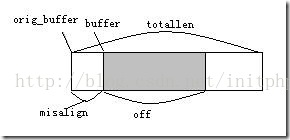

# Windows 开发 - libevent

## 目录
一、event_base

1. 创建event_base

2. 查看IO模型

3. 销毁event_base

4. 事件循环 event loop

5. event_base的例子

二、event 事件

1. 创建一个事件event

2. 释放event_free

3. 注册event

4.event_assign

5. 信号事件

6. event细节

三、Socket实例

四、Bufferevent

1. 创建Bufferevent API

2. 释放Bufferevent

3. 设置Bufferevent的回调函数和相关设置

4. 输入输出相关函数

5. 写入输出函数2

6. 使用Bufferevent后的Socket例子

五、Evbuffer IO缓冲

1.  创建和销毁Evbuffer

2. 线程锁

3. 检查buffer长度，比较常用

4. 向buffer中添加数据

5. 删除和移动buffer中的内容

6. 搜索buffer中的内容

7. 面向行的读取

8. 复制数据

9. 使用Evbuffer优化后的例子

六、Util工具

1. 时间处理函数

2. Socket API

3. 字符串

4. 安全的随机函数

5. 日志配置

七、附：一个客户端例子

---
## Libevent介绍
libevent是一个事件触发的网络库，适用于windows、linux、bsd等多种平台，内部使用select、epoll、kqueue等系统调用管理事件机制。著名分布式缓存软件memcached也是libevent based，而且libevent在使用上可以做到跨平台，而且根据libevent官方网站上公布的数据统计，似乎也有着非凡的性能。

[libevent官方网站](https://libevent.org/)  
[英文文档](http://www.wangafu.net/~nickm/libevent-book/)  
[中文文档](http://www.cppblog.com/mysileng/category/20374.html)

Libevent是基于事件的网络库。说的通俗点，例如我的客户端连接到服务端属于一个连接的事件，当这个事件触发的时候就会去处理。
该文章阅读过程中，请结合下面的socket例子，可能会更加清晰的理解每一个接口的用法。

## 一、event_base
### 1. 创建event_base
---
event_base是event（事件，后面会讲event）的一个集合。event_base中存放你是监听是否就绪的event。一般情况下一个线程一个event_base，多个线程的情况下需要开多个event_base。

**event_base主要是用来管理和实现事件的监听循环。**

一般情况下直接new一个event_base就可以满足大部分需求了，如果需要配置参数的，可以参见libevent官网。

创建方法：
```C++
struct event_base *event_base_new(void);
```
销毁方法：
```C++
void event_base_free(struct event_base *base);
```
重新初始化：
```C++
int event_reinit(struct event_base *base);
```
### 2. 查看IO模型
---
IO多路复用模型中 （[IO模型文章](https://blog.csdn.net/initphp/article/details/42011845)），有多种方法可以供我们选择，但是这些模型是在不同的平台下面的： select  poll  epoll  kqueue  devpoll  evport  win32

当我们创建一个event_base的时候，libevent会自动为我们选择最快的IO多路复用模型，Linux下一般会用epoll模型。

下面这个方法主要是用来获取IO模型的名称。
```C++
const char *event_base_get_method(const struct event_base *base);
```
### 3. 销毁event_base
---
```C++
void event_base_free(struct event_base *base);
```
### 4. 事件循环 event loop
---
我们上面说到 event_base是一组event的集合，我们也可以将event事件注册到这个集合中。当需要事件监听的时候，我们就需要对这个event_base进行循环。

下面这个函数非常重要，会在内部不断的循环监听注册上来的事件。
```C++
int event_base_dispatch(struct event_base *base);
```
返回值：0 表示成功退出  -1 表示存在错误信息。

还可以用这个方法：
```C++
#define EVLOOP_ONCE             0x01
#define EVLOOP_NONBLOCK         0x02
#define EVLOOP_NO_EXIT_ON_EMPTY 0x04
 
int event_base_loop(struct event_base *base, int flags);
```
event_base_loop这个方法会比event_base_dispatch这个方法更加灵活一些。  
* EVLOOP_ONCE： 阻塞直到有一个活跃的event，然后执行完活跃事件的回调就退出。  
* EVLOOP_NONBLOCK : 不阻塞，检查哪个事件准备好，调用优先级最高的那一个，然后退出。  

_0：如果参数填了0，则只有事件进来的时候才会调用一次事件的回调函数，比较常用_

事件循环停止的情况：
* event_base中没有事件event
* 调用event_base_loopbreak()，那么事件循环将停止
* 调用event_base_loopexit()，那么事件循环将停止
* 程序错误，异常退出
两个退出的方法：
```C++
// 这两个函数成功返回 0 失败返回 -1
// 指定在 tv 时间后停止事件循环
// 如果 tv == NULL 那么将无延时的停止事件循环
int event_base_loopexit(struct event_base *base,const struct timeval *tv);
// 立即停止事件循环（而不是无延时的停止）
int event_base_loopbreak(struct event_base *base);
```
两个方法区别：
* event_base_loopexit(base, NULL) 如果当前正在为多个活跃事件调用回调函数，那么不会立即退出，而是等到所有的活跃事件的回调函数都执行完成后才退出事件循环
* event_base_loopbreak(base) 如果当前正在为多个活跃事件调用回调函数，那么当前正在调用的回调函数会被执行，然后马上退出事件循环，而并不处理其他的活跃事件了
### 5. event_base的例子
---
```C++
#include <stdio.h>
#include <stdlib.h>
#include <unistd.h>
#include <sys/types.h>    
#include <sys/socket.h>    
#include <netinet/in.h>    
#include <arpa/inet.h>   
#include <string.h>
#include <fcntl.h> 
 
#include <event2/event.h>
#include <event2/bufferevent.h>
 
int main() {
	puts("init a event_base!");
	struct event_base *base; //定义一个event_base
	base = event_base_new(); //初始化一个event_base
	const char *x =  event_base_get_method(base); //查看用了哪个IO多路复用模型，linux一下用epoll
	printf("METHOD:%s\n", x);
	int y = event_base_dispatch(base); //事件循环。因为我们这边没有注册事件，所以会直接退出
	event_base_free(base);  //销毁libevent
	return 1;
}
```
返回：  


## 二、event 事件
event_base是事件的集合，负责事件的循环，以及集合的销毁。而event就是event_base中的基本单元：事件。

我们举一个简单的例子来理解事件。例如我们的socket来进行网络开发的时候，都会使用accept这个方法来阻塞监听是否有客户端socket连接上来，如果客户端连接上来，则会创建一个线程用于服务端与客户端进行数据的交互操作，而服务端会继续阻塞等待下一个客户端socket连接上来。客户端连接到服务端实际就是一种事件。
### 1. 创建一个事件event
---
```C++
struct event *event_new(struct event_base *base, evutil_socket_t fd,short what, event_callback_fn cb,void *arg);
```
参数：
* base：即event_base
* fd：文件描述符。
* what：event关心的各种条件。
* cb：回调函数。
* arg：用户自定义的数据，可以传递到回调函数中去。  

libevent是基于事件的，也就是说只有在事件到来的这种条件下才会触发当前的事件。例如：
* fd文件描述符已准备好可写或者可读
* fd马上就准备好可写和可读。
* 超时的情况 timeout
* 信号中断
* 用户触发的事件
what参数 event各种条件：
```C++
// 超时
#define EV_TIMEOUT 0x01
// event 相关的文件描述符可以读了
#define EV_READ 0x02
// event 相关的文件描述符可以写了
#define EV_WRITE 0x04
// 被用于信号检测（详见下文）
#define EV_SIGNAL 0x08
// 用于指定 event 为 persistent 持久类型。当事件执行完毕后，不会被删除，继续保持pending等待状态;
// 如果是非持久类型，则回调函数执行完毕后，事件就会被删除，想要重新使用这个事件，就必须将这个事件继续添加event_add 
#define EV_PERSIST 0x10
// 用于指定 event 会被边缘触发
#define EV_ET 0x20
```
### 2. 释放event_free
---
真正的释放event的内存。
```C++
void event_free(struct event *event);
```
event_del 清理event的内存。这个方法并不是真正意义上的释放内存。

当函数会将事件转为 非pending和非activing的状态。
```C++
int event_del(struct event *event);
```
### 3. 注册event
---
该方法将用于向event_base注册事件。

参数：ev 为事件指针；tv 为时间指针。当tv = NULL的时候则无超时时间。

函数返回：0表示成功 -1 表示失败。
```C++
int event_add(struct event *ev, const struct timeval *tv);
```
tv时间结构例子：
```C++
struct timeval five_seconds = {5, 0};
event_add(ev1, &five_seconds);
```
### 4.event_assign
---
event_new每次都会在堆上分配内存。有些场景下并不是每次都需要在堆上分配内存的，这个时候我们就可以用到event_assign方法。

已经初始化或者处于 pending 的 event，首先需要调用 event_del() 后再调用 event_assign()。这个时候就可以重用这个event了。
```C++
// 此函数用于初始化 event（包括可以初始化栈上和静态存储区中的 event）
// event_assign() 和 event_new() 除了 event 参数之外，使用了一样的参数
// event 参数用于指定一个未初始化的且需要初始化的 event
// 函数成功返回 0 失败返回 -1
int event_assign(struct event *event, struct event_base *base,evutil_socket_t fd, short what,void (*callback)(evutil_socket_t, short, void *), void *arg);
     
// 类似上面的函数，此函数被信号 event 使用
event_assign(event, base, signum, EV_SIGNAL|EV_PERSIST, callback, arg)
```
### 5. 信号事件
---
信号事件也可以对信号进行事件的处理。用法和event_new类似。只不过处理的是信号而已。
```C++
// base --- event_base
// signum --- 信号，例如 SIGHUP
// callback --- 信号出现时调用的回调函数
// arg --- 用户自定义数据
evsignal_new(base, signum, cb, arg)
     
//将信号 event 注册到 event_base
evsignal_add(ev, tv) 
     
// 清理信号 event
evsignal_del(ev) 
```
### 6. event细节
---
* 每一个事件event都需要通过event_new初始化生成。event_new生成的事件是在堆上分配的内存。
* 当一个事件通过event_add被注册到event_base上的时候，这个事件处于pending（等待状态），当只有有事件进来的时候，event才会被激活active状态，相关的回调函数就会被调用。
* persistent 如果event_new中的what参数选择了EV_PERSIST，则是持久的类型。持久的类型调用玩回调函数后，会继续转为pending状态，就会继续等待事件进来。大部分情况下会选择持久类型的事件。
* 而非持久的类型的事件，调用玩一次之后，就会变成初始化的状态。_这个时候需要调用event_add 继续将事件注册到event_base上之后才能使用。_
## 三、Socket实例
```C++
#include <stdio.h>
#include <stdlib.h>
#include <unistd.h>
#include <sys/types.h>    
#include <sys/socket.h>    
#include <netinet/in.h>    
#include <arpa/inet.h>   
#include <string.h>
#include <fcntl.h> 
 
#include <event2/event.h>
#include <event2/bufferevent.h>
 
//读取客户端
void do_read(evutil_socket_t fd, short event, void *arg) {
    //继续等待接收数据  
    char buf[1024];  //数据传送的缓冲区    
    int len;  
    if ((len = recv(fd, buf, 1024, 0)) > 0)  {  
        buf[len] = '\0';    
        printf("%s\n", buf);    
        if (send(fd, buf, len, 0) < 0) {    //将接受到的数据写回客户端
            perror("write");    
        }
    } 
}
 
 
//回调函数，用于监听连接进来的客户端socket
void do_accept(evutil_socket_t fd, short event, void *arg) {
    int client_socketfd;//客户端套接字    
    struct sockaddr_in client_addr; //客户端网络地址结构体   
    int in_size = sizeof(struct sockaddr_in);  
    //客户端socket  
    client_socketfd = accept(fd, (struct sockaddr *) &client_addr, &in_size); //等待接受请求，这边是阻塞式的  
    if (client_socketfd < 0) {  
        puts("accpet error");  
        exit(1);
    }  
 
    //类型转换
    struct event_base *base_ev = (struct event_base *) arg;
 
    //socket发送欢迎信息  
    char * msg = "Welcome to My socket";  
    int size = send(client_socketfd, msg, strlen(msg), 0);  
 
    //创建一个事件，这个事件主要用于监听和读取客户端传递过来的数据
    //持久类型，并且将base_ev传递到do_read回调函数中去
    struct event *ev;
    ev = event_new(base_ev, client_socketfd, EV_TIMEOUT|EV_READ|EV_PERSIST, do_read, base_ev);
    event_add(ev, NULL);
}
 
 
//入口主函数
int main() {
 
    int server_socketfd; //服务端socket  
    struct sockaddr_in server_addr;   //服务器网络地址结构体    
    memset(&server_addr,0,sizeof(server_addr)); //数据初始化--清零    
    server_addr.sin_family = AF_INET; //设置为IP通信    
    server_addr.sin_addr.s_addr = INADDR_ANY;//服务器IP地址--允许连接到所有本地地址上    
    server_addr.sin_port = htons(8001); //服务器端口号    
  
    //创建服务端套接字  
    server_socketfd = socket(PF_INET,SOCK_STREAM,0);  
    if (server_socketfd < 0) {  
        puts("socket error");  
        return 0;  
    }  
 
    evutil_make_listen_socket_reuseable(server_socketfd); //设置端口重用
    evutil_make_socket_nonblocking(server_socketfd); //设置无阻赛
  
    //绑定IP  
    if (bind(server_socketfd, (struct sockaddr *)&server_addr, sizeof(struct sockaddr))<0) {  
        puts("bind error");  
        return 0;  
    }  
 
    //监听,监听队列长度 5  
    listen(server_socketfd, 10);  
    
    //创建event_base 事件的集合，多线程的话 每个线程都要初始化一个event_base
    struct event_base *base_ev;
    base_ev = event_base_new(); 
    const char *x =  event_base_get_method(base_ev); //获取IO多路复用的模型，linux一般为epoll
    printf("METHOD:%s\n", x);
 
    //创建一个事件，类型为持久性EV_PERSIST，回调函数为do_accept（主要用于监听连接进来的客户端）
    //将base_ev传递到do_accept中的arg参数
    struct event *ev;
    ev = event_new(base_ev, server_socketfd, EV_TIMEOUT|EV_READ|EV_PERSIST, do_accept, base_ev);
 
    //注册事件，使事件处于 pending的等待状态
    event_add(ev, NULL);
 
    //事件循环
    event_base_dispatch(base_ev);
 
    //销毁event_base
	event_base_free(base_ev);  
	return 1;
}
```
说明：

1. 必须设置socket为非阻塞模式，否则就会阻塞在那边，影响整个程序运行
```C++
evutil_make_listen_socket_reuseable(server_socketfd); //设置端口重用
evutil_make_socket_nonblocking(server_socketfd); //设置无阻赛
```
2. 我们首选建立的事件主要用于监听客户端的连入。当客户端有socket连接到服务器端的时候，回调函数do_accept就会去执行；当空闲的时候，这个事件就会是一个pending等待状态，等待有新的连接进来，新的连接进来了之后又会继续执行。
```C++
struct event *ev;
ev = event_new(base_ev, server_socketfd, EV_TIMEOUT|EV_READ|EV_PERSIST, do_accept, base_ev);
```
3. 在do_accept事件中我们创建了一个新的事件，这个事件的回调函数是do_read。主要用来循环监听客户端上传的数据。do_read这个方法会一直循环执行，接收到客户端数据就会进行处理。
```C++
//创建一个事件，这个事件主要用于监听和读取客户端传递过来的数据
//持久类型，并且将base_ev传递到do_read回调函数中去
struct event *ev;
ev = event_new(base_ev, client_socketfd, EV_TIMEOUT|EV_READ|EV_PERSIST, do_read, base_ev);
event_add(ev, NULL);
```
## 四、Bufferevent
上面的socket例子估计经过测试估计大家就会有很多疑问：

* do_read方法作为一个事件会一直被循环
* 当客户端连接断开的时候，do_read方法还是在循环，根本不知道客户端已经断开socket的连接。
* 需要解决各种粘包和拆包（相关粘包拆包文章）问题
如果要解决这个问题，我们可能要做大量的工作来维护这些socket的连接状态，读取状态。而Libevent的Bufferevent帮我们解决了这些问题。

_Bufferevent主要是用来管理和调度IO事件；而Evbuffer（下面一节会讲到）主要用来缓冲网络IO数据。_

Bufferevent目前支持TCP协议，而不知道UDP协议。我们这边也只讲TCP协议下的Bufferevent的使用。

我们先看下下面的接口（然后结合下面改进socket的例子，自己动手去实验一下）：

### 1. 创建Bufferevent API
---
```C++
//创建一个Bufferevent
struct bufferevent *bufferevent_socket_new(struct event_base *base, evutil_socket_t fd, enum bufferevent_options options);
```
参数：

base：即event_base

fd：文件描述符。如果是socket的方法，则socket需要设置为非阻塞的模式。

options：行为选项，下面是行为选项内容

* BEV_OPT_CLOSE_ON_FREE ：当 bufferevent 被释放同时关闭底层（socket 被关闭等） _一般用这个选项_
* BEV_OPT_THREADSAFE ：为 bufferevent 自动分配锁，这样能够在多线程环境中安全使用
* BEV_OPT_DEFER_CALLBACKS ： 当设置了此标志，bufferevent 会延迟它的所有回调（参考前面说的延时回调）
* BEV_OPT_UNLOCK_CALLBACKS ： 如果 bufferevent 被设置为线程安全的，用户提供的回调被调用时 bufferevent 的锁会被持有。如果设置了此选项，Libevent 将在调用你的回调时释放 bufferevent 的锁
### 2. 释放Bufferevent
---
```C++
void bufferevent_free(struct bufferevent *bev);
```
如果设置了延时回调BEV_OPT_DEFER_CALLBACKS，则释放会在延时回调调用了回调函数之后，才会真正释放。

### 3. 设置Bufferevent的回调函数和相关设置
---
前面我们说过了，使用了Bufferevent之后，Libevent会帮我们托管三种事件：_1. 读取事件  2. 写入事件  3. 处理事件_

我们先看一下回调函数结构：

1. 读取和写入的回调函数结构，其中 ctx为通用传递的参数
```C++
typedef void (*bufferevent_data_cb)(struct bufferevent *bev, void *ctx);
```
2. 事件回调，即连接断开、错误处理等回调。其中ctx为通用传递的参数。

events参数为事件，用户可以在回调函数中拿到这个事件来进行事务处理的判断：

* BEV_EVENT_READING   在 bufferevent 上进行读取操作时出现了一个事件
* BEV_EVENT_WRITING  在 bufferevent 上进行写入操作时出现了一个事件
* BEV_EVENT_ERROR  进行 bufferevent 操作时出错
* BEV_EVENT_TIMEOUT  在 bufferevent 上出现了超时
* BEV_EVENT_EOF  在 bufferevent 上遇到了文件结束符，连接断开
* BEV_EVENT_CONNECTED 在 bufferevent 上请求连接完成了
```C++
typedef void (*bufferevent_event_cb)(struct bufferevent *bev, short events, void *ctx);
```
3. 在bufferevent上设置回调函数。

* bufev：bufferevent_socket_new创建的bufferevent
* readcb：读取事件的回调函数，没有则可以为NULL
* writecb：写入事件的回调函数，没有则可以为NULL
* eventcb：事件函数的回调函数，没有则可以为NULL，一般我们可以在这里面判断连接断开等。
* cbarg：公用传输的传递
通过这个函数，我们就可以设置我们需要的一些回调函数信息。
```C++
void bufferevent_setcb(struct bufferevent *bufev,bufferevent_data_cb readcb,bufferevent_data_cb writecb,bufferevent_event_cb eventcb,void *cbarg);
```
取回回调函数:
```C++
void bufferevent_getcb(struct bufferevent *bufev,bufferevent_data_cb *readcb_ptr,bufferevent_data_cb *writecb_ptr,bufferevent_event_cb *eventcb_ptr,void **cbarg_ptr)
```
4. 设置Bufferevent事件的类型
```C++
bufferevent_enable(bev, EV_READ|EV_WRITE|EV_PERSIST);
```
5. 水位设置。

水位设置可以这么理解，bufferevent相当于一个水位容器，其中参数：

* events：EV_READ 则为设置读取事件；EV_WRITE 则为写入事件。EV_READ |  EV_WRITE 为设置两者的水位。
* lowmark：最低水位，默认为0。_这个参数非常重要，例如lowmark设置为10，则当bufferevent容器中有10个字符的时候才会去调用readcb这个回调函数。_
```C++
void bufferevent_setwatermark(struct bufferevent *bufev, short events,size_t lowmark, size_t highmark);
```
6. 下面可以看一个设置和回调函数例子：
```C++
//创建一个bufferevent
struct bufferevent *bev = bufferevent_socket_new(base_ev, client_socketfd, BEV_OPT_CLOSE_ON_FREE);
//设置读取方法和error时候的方法
bufferevent_setcb(bev, read_cb, NULL, error_cb, base_ev);  
//设置类型
bufferevent_enable(bev, EV_READ|EV_WRITE|EV_PERSIST);
//设置水位
bufferevent_setwatermark(bev, EV_READ, 0, 0);
 
//读取事件回调函数
void read_cb(struct bufferevent *bev, void *arg) {
    #define MAX_LINE    256
    char line[MAX_LINE+1];
    int n;
    evutil_socket_t fd = bufferevent_getfd(bev);
    while (n = bufferevent_read(bev, line, MAX_LINE), n > 0) {
        line[n] = '\0';
        printf("fd=%u, read line: %s\n", fd, line);
        bufferevent_write(bev, line, n);
    }
    puts("haha");
}
//写入事件回调函数
void write_cb(struct bufferevent *bev, void *arg) {}
//事件回调
void error_cb(struct bufferevent *bev, short event, void *arg) {
    evutil_socket_t fd = bufferevent_getfd(bev);
    printf("fd = %u, ", fd);
    if (event & BEV_EVENT_TIMEOUT) {
        printf("Timed out\n");
    } else if (event & BEV_EVENT_EOF) {
        printf("connection closed\n");
    } else if (event & BEV_EVENT_ERROR) {
        printf("some other error\n");
    }
    bufferevent_free(bev);
}
```
### 4. 输入输出相关函数
---
1. 获取buffer：
```C++
// 获取到输入 buffer
struct evbuffer *bufferevent_get_input(struct bufferevent *bufev);
// 获取到输出 buffer
struct evbuffer *bufferevent_get_output(struct bufferevent *bufev);
```
2. 写入和输出函数，成功返回0，失败返回-1：
* bufev：bufferevent
* data：写入的字符串数据
* size：字符长度
```C++
//写入
int bufferevent_write(struct bufferevent *bufev, const void *data, size_t size);
//输出
size_t bufferevent_read(struct bufferevent *bufev, void *data, size_t size);
```
### 5. 写入输出函数2
* bufev：bufferevent
* buf：buffer块  下面会讲到evbuffer的使用
```C++
int bufferevent_write_buffer(struct bufferevent *bufev, struct evbuffer *buf);
int bufferevent_read_buffer(struct bufferevent *bufev,struct evbuffer *buf);
```
### 6. 使用Bufferevent后的Socket例子
上面我们已经介绍完了Bufferevent的相关API，可以看下具体例子。
```c++
#include <stdio.h>
#include <stdlib.h>
#include <unistd.h>
#include <sys/types.h>    
#include <sys/socket.h>    
#include <netinet/in.h>    
#include <arpa/inet.h>   
#include <string.h>
#include <fcntl.h> 
 
#include <event2/event.h>
#include <event2/bufferevent.h>
 
void read_cb(struct bufferevent *bev, void *arg) {
    #define MAX_LINE    256
    char line[MAX_LINE+1];
    int n;
    evutil_socket_t fd = bufferevent_getfd(bev);
    while (n = bufferevent_read(bev, line, MAX_LINE), n > 0) {
        line[n] = '\0';
        printf("fd=%u, read line: %s\n", fd, line);
        bufferevent_write(bev, line, n);
    }
    puts("haha");
}
void write_cb(struct bufferevent *bev, void *arg) {}
void error_cb(struct bufferevent *bev, short event, void *arg) {
    evutil_socket_t fd = bufferevent_getfd(bev);
    printf("fd = %u, ", fd);
    if (event & BEV_EVENT_TIMEOUT) {
        printf("Timed out\n");
    } else if (event & BEV_EVENT_EOF) {
        printf("connection closed\n");
    } else if (event & BEV_EVENT_ERROR) {
        printf("some other error\n");
    }
    bufferevent_free(bev);
}
 
//回调函数，用于监听连接进来的客户端socket
void do_accept(evutil_socket_t fd, short event, void *arg) {
    int client_socketfd;//客户端套接字    
    struct sockaddr_in client_addr; //客户端网络地址结构体   
    int in_size = sizeof(struct sockaddr_in);  
    //客户端socket  
    client_socketfd = accept(fd, (struct sockaddr *) &client_addr, &in_size); //等待接受请求，这边是阻塞式的  
    if (client_socketfd < 0) {  
        puts("accpet error");  
        exit(1);
    }  
 
    //类型转换
    struct event_base *base_ev = (struct event_base *) arg;
 
    //socket发送欢迎信息  
    char * msg = "Welcome to My socket";  
    int size = send(client_socketfd, msg, strlen(msg), 0);  
 
    //创建一个事件，这个事件主要用于监听和读取客户端传递过来的数据
    //持久类型，并且将base_ev传递到do_read回调函数中去
    //struct event *ev;
    //ev = event_new(base_ev, client_socketfd, EV_TIMEOUT|EV_READ|EV_PERSIST, do_read, base_ev);
    //event_add(ev, NULL);
 
    //创建一个bufferevent
    struct bufferevent *bev = bufferevent_socket_new(base_ev, client_socketfd, BEV_OPT_CLOSE_ON_FREE);
    //设置读取方法和error时候的方法
    bufferevent_setcb(bev, read_cb, NULL, error_cb, base_ev);  
    //设置类型
    bufferevent_enable(bev, EV_READ|EV_WRITE|EV_PERSIST);
    //设置水位，每次接受10个字符
    bufferevent_setwatermark(bev, EV_READ, 0, 10);
}
 
 
//入口主函数
int main() {
 
    int server_socketfd; //服务端socket  
    struct sockaddr_in server_addr;   //服务器网络地址结构体    
    memset(&server_addr,0,sizeof(server_addr)); //数据初始化--清零    
    server_addr.sin_family = AF_INET; //设置为IP通信    
    server_addr.sin_addr.s_addr = INADDR_ANY;//服务器IP地址--允许连接到所有本地地址上    
    server_addr.sin_port = htons(8001); //服务器端口号    
  
    //创建服务端套接字  
    server_socketfd = socket(PF_INET,SOCK_STREAM,0);  
    if (server_socketfd < 0) {  
        puts("socket error");  
        return 0;  
    }  
 
    evutil_make_listen_socket_reuseable(server_socketfd); //设置端口重用
    evutil_make_socket_nonblocking(server_socketfd); //设置无阻赛
  
    //绑定IP  
    if (bind(server_socketfd, (struct sockaddr *)&server_addr, sizeof(struct sockaddr))<0) {  
        puts("bind error");  
        return 0;  
    }  
 
    //监听,监听队列长度 5  
    listen(server_socketfd, 10);  
    
    //创建event_base 事件的集合，多线程的话 每个线程都要初始化一个event_base
    struct event_base *base_ev;
    base_ev = event_base_new(); 
    const char *x =  event_base_get_method(base_ev); //获取IO多路复用的模型，linux一般为epoll
    printf("METHOD:%s\n", x);
 
    //创建一个事件，类型为持久性EV_PERSIST，回调函数为do_accept（主要用于监听连接进来的客户端）
    //将base_ev传递到do_accept中的arg参数
    struct event *ev;
    ev = event_new(base_ev, server_socketfd, EV_TIMEOUT|EV_READ|EV_PERSIST, do_accept, base_ev);
 
    //注册事件，使事件处于 pending的等待状态
    event_add(ev, NULL);
 
    //事件循环
    event_base_dispatch(base_ev);
 
    //销毁event_base
	event_base_free(base_ev);  
	return 1;
}
```
## 五、Evbuffer IO缓冲
上面讲了Bufferevent主要用于事件的管理和调度IO。而Evbuffer给我们提供了非常实用的IO缓存工具。

上一个例子中，虽然解决了断开连接、读取事件等IO管理的工作，但是也是存在缺陷的。

1. 因为TCP粘包拆包的原因，我们不知道一次接收到的数据是否是完整的。

2. 我们无法根据客户端传递过来的数据来分析客户端的请求信息。

[详细参考](http://www.cppblog.com/mysileng/archive/2013/02/05/197748.html)

根据上面的问题，我们可能会考虑设计一个缓冲容器，这个容器主要用来不停得接收客户端传递过来的数据信息，并且要等到信息量接收到一定的程度的时候，我们对客户端的信息进行分析处理，最后才能知道客户端的请求内容。如果自己做这个缓冲容器，恐怕是需要花费很多的时间，而Libevent已经给我们设计了Evbuffer，我们可以直接使用Evbuffer缓冲容器来满足我们的业务需求。

evbuffer结构：
```C++
struct evbuffer{
  // 当前有效缓冲区的内存起始地址
 u_char *buffer; 
  // 整个分配(realloc)用来缓冲的内存起始地址
  u_char *orig_buffer; 
  // origin_buffer和buffer之间的字节数
 size_t misalign; 
  // 整个分配用来缓冲的内存字节数
 size_t totallen; 
  // 当前有效缓冲区的长度(字节数)
 size_t off; 
  //回到函数，当缓冲区有变化的时候会被调用
 void (*cb)(struct evbuffer *, size_t, size_t, void *);
  //回调函数的参数
 void *cbarg; 
};
```
libevent的缓冲是一个连续的内存区域，其处理数据的方式(写数据和读数据)更像一个队列操作方式：从后写入，从前
读出。evbuffer分别设置相关指针(一个指标)用于指示读出位置和写入位置。其大致结构如图：（此段参考网上文章）


orig_buffer指向由realloc分配的连续内存区域，buffer指向有效数据的内存区域，totallen表示orig_buffer指向的内存
区域的大小，misalign表示buffer相对于orig_buffer的偏移，off表示有效数据的长度。

下面是一些基础的和最常用的API，详细的API设计，还是请翻看官方网站：

### 1.  创建和销毁Evbuffer
```C++
struct evbuffer *evbuffer_new(void);
void evbuffer_free(struct evbuffer *buf);
```
### 2. 线程锁
```C++
int evbuffer_enable_locking(struct evbuffer *buf, void *lock);
void evbuffer_lock(struct evbuffer *buf);
void evbuffer_unlock(struct evbuffer *buf);
```
### 3. 检查buffer长度，比较常用
```C++
size_t evbuffer_get_length(const struct evbuffer *buf);
```
返回的是buffer中的字节数。

### 4. 向buffer中添加数据
```C++
int evbuffer_add(struct evbuffer *buf, const void *data, size_t datlen);
```
这个函数添加data处的datalen字节到buf的末尾，成功时返回0，失败时返回-1。
```C++
int evbuffer_expand(struct evbuffer *buf, size_t datlen);
```
这个函数修改缓冲区的最后一块，或者添加一个新的块，使得缓冲区足以容纳datlen字节，而不需要更多的内存分配。
```C++
int evbuffer_prepend(struct evbuffer *buf, const void *data, size_t size);
int evbuffer_prepend_buffer(struct evbuffer *dst, struct evbuffer* src);
```
除了将数据移动到目标缓冲区前面之外，这两个函数的行为分别与evbuffer_add()和evbuffer_add_buffer()相同。
使用这些函数时要当心，永远不要对与bufferevent共享的evbuffer使用。这些函数是2.0.1-alpha版本新添加的。

### 5. 删除和移动buffer中的内容
```C++
int evbuffer_remove(struct evbuffer *buf, void *data, size_t datlen);
```
evbuffer_remove（）函数从buf前面复制和移除datlen字节到data处的内存中。如果可用字节少于datlen，函数复制所有字节。失败时返回-1，否则返回复制了的字节数。
```C++
int evbuffer_add_buffer(struct evbuffer *dst, struct evbuffer *src);
int evbuffer_remove_buffer(struct evbuffer *src, struct evbuffer *dst,size_t datlen);
```
* evbuffer_add_buffer()将src中的所有数据移动到dst末尾，成功时返回0，失败时返回-1。
* evbuffer_remove_buffer()函数从src中移动datlen字节到dst末尾，尽量少进行复制。如果字节数小于datlen，所有字节被移动。函数返回移动的字节数。
* evbuffer_add_buffer()在0.8版本引入；evbuffer_remove_buffer()是2.0.1-alpha版本新增加的。
### 6. 搜索buffer中的内容
```C++
struct evbuffer_ptr {
        ev_ssize_t pos;
        struct {
                /* internal fields */
        } _internal;
};
struct evbuffer_ptr evbuffer_search(struct evbuffer *buffer,const char *what, size_t len, const struct evbuffer_ptr *start);
struct evbuffer_ptr evbuffer_search_range(struct evbuffer *buffer,const char *what, size_t len, const struct evbuffer_ptr *start,const struct evbuffer_ptr *end);
struct evbuffer_ptr evbuffer_search_eol(struct evbuffer *buffer,struct evbuffer_ptr *start, size_t *eol_len_out,enum evbuffer_eol_style eol_style);
```
结构evbuffer_ptr中的pos为偏移量，如果为-1则没查询到，大于-1，则搜索到了匹配的位置。

* evbuffer_search()函数在缓冲区中查找含有len个字符的字符串what。函数返回包含字符串位置，或者在没有找到字符串时包含-1的evbuffer_ptr结构体。如果提供了start参数，则从指定的位置开始搜索；否则，从开始处进行搜索。
* evbuffer_search_range()函数和evbuffer_search行为相同，只是它只考虑在end之前出现的what。
* evbuffer_search_eol()函数像evbuffer_readln()一样检测行结束，但是不复制行，而是返回指向行结束符的evbuffer_ptr。如果eol_len_out非空，则它被设置为EOL字符串长度。
### 7. 面向行的读取
---
很多互联网协议都是基于行的。evbuffer_readln()函数从evbuffer前面取出一行，用一个新分配的空字符结束的字符串返回这一行。如果n_read_out不是NULL，则它被设置为返回的字符串的字节数。如果没有整行供读取，函数返回空。返回的字符串不包括行结束符。
```c++
enum evbuffer_eol_style {
        EVBUFFER_EOL_ANY,
        EVBUFFER_EOL_CRLF,
        EVBUFFER_EOL_CRLF_STRICT,
        EVBUFFER_EOL_LF,
        EVBUFFER_EOL_NUL
};
char *evbuffer_readln(struct evbuffer *buffer, size_t *n_read_out,enum evbuffer_eol_style eol_style);
```
* EVBUFFER_EOL_LF：行尾是单个换行符（也就是\n，ASCII值是0x0A）
* EVBUFFER_EOL_CRLF_STRICT：行尾是一个回车符，后随一个换行符（也就是\r\n，ASCII值是0x0D 0x0A）
* EVBUFFER_EOL_CRLF：行尾是一个可选的回车，后随一个换行符（也就是说，可以是\r\n或者\n）。这种格式对于解析基于文本的互联网协议很有用，因为标准通常要求\r\n的行结束符，而不遵循标准的客户端有时候只使用\n。
* EVBUFFER_EOL_ANY：行尾是任意数量、任意次序的回车和换行符。这种格式不是特别有用。它的存在主要是为了向后兼容。
例子：
```C++
	//readline
	char * rline;
	size_t len;
	rline = evbuffer_readln(buf, &len, EVBUFFER_EOL_CRLF);
	puts("Hello");
	if (rline != NULL) {
		bufferevent_write_buffer(bev, buf); //使用buffer的方式输出结果
	}
```
### 8. 复制数据
```C++
ev_ssize_t evbuffer_copyout(struct evbuffer *buf, void *data, size_t datlen);
ev_ssize_t evbuffer_copyout_from(struct evbuffer *buf,const struct evbuffer_ptr *pos,void *data_out, size_t datlen);
```
evbuffer_copyout（）的行为与evbuffer_remove（）相同，但是它不从缓冲区移除任何数据。也就是说，它从buf前面复制datlen字节到data处的内存中。如果可用字节少于datlen，函数会复制所有字节。失败时返回-1，否则返回复制的字节数。
如果从缓冲区复制数据太慢，可以使用evbuffer_peek（）。
### 9. 使用Evbuffer优化后的例子
```C++
#include <stdio.h>
#include <stdlib.h>
#include <unistd.h>
#include <sys/types.h>    
#include <sys/socket.h>    
#include <netinet/in.h>    
#include <arpa/inet.h>   
#include <string.h>
#include <fcntl.h> 
 
#include <event2/event.h>
#include <event2/bufferevent.h>
#include <event2/buffer.h>
#define MAX_LINE    256
 
void read_cb(struct bufferevent *bev, void *arg) {
    struct evbuffer *buf = (struct evbuffer *)arg;
    char line[MAX_LINE+1];
    int n;
    evutil_socket_t fd = bufferevent_getfd(bev);
    while (n = bufferevent_read(bev, line, MAX_LINE), n > 0) {
        line[n] = '\0';
        
        //将读取到的内容放进缓冲区
        evbuffer_add(buf, line, n);
 
        //搜索匹配缓冲区中是否有==，==号来分隔每次客户端的请求
        const char *x = "==";
        struct evbuffer_ptr ptr = evbuffer_search(buf, x, strlen(x), 0);   
        if (ptr.pos != -1) {
            bufferevent_write_buffer(bev, buf); //使用buffer的方式输出结果
        }
    }
}
void write_cb(struct bufferevent *bev, void *arg) {}
void error_cb(struct bufferevent *bev, short event, void *arg) {
    evutil_socket_t fd = bufferevent_getfd(bev);
    printf("fd = %u, ", fd);
    if (event & BEV_EVENT_TIMEOUT) {
        printf("Timed out\n");
    } else if (event & BEV_EVENT_EOF) {
        printf("connection closed\n");
    } else if (event & BEV_EVENT_ERROR) {
        printf("some other error\n");
    }
    //清空缓冲区
    struct evbuffer *buf = (struct evbuffer *)arg;
    evbuffer_free(buf);
    bufferevent_free(bev);
}
 
//回调函数，用于监听连接进来的客户端socket
void do_accept(evutil_socket_t fd, short event, void *arg) {
    int client_socketfd;//客户端套接字    
    struct sockaddr_in client_addr; //客户端网络地址结构体   
    int in_size = sizeof(struct sockaddr_in);  
    //客户端socket  
    client_socketfd = accept(fd, (struct sockaddr *) &client_addr, &in_size); //等待接受请求，这边是阻塞式的  
    if (client_socketfd < 0) {  
        puts("accpet error");  
        exit(1);
    }  
 
    //类型转换
    struct event_base *base_ev = (struct event_base *) arg;
 
    //socket发送欢迎信息  
    char * msg = "Welcome to My socket";  
    int size = send(client_socketfd, msg, strlen(msg), 0);  
 
    //创建一个事件，这个事件主要用于监听和读取客户端传递过来的数据
    //持久类型，并且将base_ev传递到do_read回调函数中去
    //struct event *ev;
    //ev = event_new(base_ev, client_socketfd, EV_TIMEOUT|EV_READ|EV_PERSIST, do_read, base_ev);
    //event_add(ev, NULL);
 
    //创建一个evbuffer，用来缓冲客户端传递过来的数据
    struct evbuffer *buf = evbuffer_new();
    //创建一个bufferevent
    struct bufferevent *bev = bufferevent_socket_new(base_ev, client_socketfd, BEV_OPT_CLOSE_ON_FREE);
    //设置读取方法和error时候的方法，将buf缓冲区当参数传递
    bufferevent_setcb(bev, read_cb, NULL, error_cb, buf);  
    //设置类型
    bufferevent_enable(bev, EV_READ|EV_WRITE|EV_PERSIST);
    //设置水位
    bufferevent_setwatermark(bev, EV_READ, 0, 0);
}
 
 
//入口主函数
int main() {
 
    int server_socketfd; //服务端socket  
    struct sockaddr_in server_addr;   //服务器网络地址结构体    
    memset(&server_addr,0,sizeof(server_addr)); //数据初始化--清零    
    server_addr.sin_family = AF_INET; //设置为IP通信    
    server_addr.sin_addr.s_addr = INADDR_ANY;//服务器IP地址--允许连接到所有本地地址上    
    server_addr.sin_port = htons(8001); //服务器端口号    
  
    //创建服务端套接字  
    server_socketfd = socket(PF_INET,SOCK_STREAM,0);  
    if (server_socketfd < 0) {  
        puts("socket error");  
        return 0;  
    }  
 
    evutil_make_listen_socket_reuseable(server_socketfd); //设置端口重用
    evutil_make_socket_nonblocking(server_socketfd); //设置无阻赛
  
    //绑定IP  
    if (bind(server_socketfd, (struct sockaddr *)&server_addr, sizeof(struct sockaddr))<0) {  
        puts("bind error");  
        return 0;  
    }  
 
    //监听,监听队列长度 5  
    listen(server_socketfd, 10);  
    
    //创建event_base 事件的集合，多线程的话 每个线程都要初始化一个event_base
    struct event_base *base_ev;
    base_ev = event_base_new(); 
    const char *x =  event_base_get_method(base_ev); //获取IO多路复用的模型，linux一般为epoll
    printf("METHOD:%s\n", x);
 
    //创建一个事件，类型为持久性EV_PERSIST，回调函数为do_accept（主要用于监听连接进来的客户端）
    //将base_ev传递到do_accept中的arg参数
    struct event *ev;
    ev = event_new(base_ev, server_socketfd, EV_TIMEOUT|EV_READ|EV_PERSIST, do_accept, base_ev);
 
    //注册事件，使事件处于 pending的等待状态
    event_add(ev, NULL);
 
    //事件循环
    event_base_dispatch(base_ev);
 
    //销毁event_base
	event_base_free(base_ev);  
	return 1;
}
```
## 六、Util工具
Libevent还提供一些工具方法。这些方法可以简化我们的开发。

### 1. 时间处理函数
```C++
    //创建一个事件，类型为持久性EV_PERSIST，回调函数为do_accept（主要用于监听连接进来的客户端）
    //将base_ev传递到do_accept中的arg参数
 
    // 用于加或者减前两个参数，结果被保存在第三个参数中
    #define evutil_timeradd(tvp, uvp, vvp) /* ... */
    #define evutil_timersub(tvp, uvp, vvp) /* ... */
     
    // 清除 timeval 将其值设置为 0
    #define evutil_timerclear(tvp) /* ... */
    // 判断 timeval 是否为 0，如果是 0 返回 false，否则返回 true
    #define evutil_timerisset(tvp) /* ... */
     
    // 比较两个 timeval
    // 使用的时候这样用：
    // evutil_timercmp(t1, t2, <=) 含义为判断 t1 <= t2 是否成立
    // cmp 为所有的 C 关系操作符
    #define evutil_timercmp(tvp, uvp, cmp)
     
    // 获取当前时间并保存到 tv
    // tz 目前无用
    int evutil_gettimeofday(struct timeval *tv, struct timezone *tz);
```
2. Socket API
```C++
    // 用于关闭一个 socket
    int evutil_closesocket(evutil_socket_t s);
    #define EVUTIL_CLOSESOCKET(s) evutil_closesocket(s)
     
    // 返回当前线程的最后一次 socket 操作的错误码
    #define EVUTIL_SOCKET_ERROR()
    // 改变当前 socket 的错误码
    #define EVUTIL_SET_SOCKET_ERROR(errcode)
    // 返回特定的 sock 的错误码
    #define evutil_socket_geterror(sock)
    // 通过 socket 错误码获取到一个字符串描述
    #define evutil_socket_error_to_string(errcode)
     
    // 设置 sock 为非阻塞的 socket
    int evutil_make_socket_nonblocking(evutil_socket_t sock);
     
    // 设置 sock 的地址可重用
    int evutil_make_listen_socket_reuseable(evutil_socket_t sock);
```
3. 字符串
```C++
    // 它们对应于标准的 snprintf 和 vsnprintf
    int evutil_snprintf(char *buf, size_t buflen, const char *format, ...);
    int evutil_vsnprintf(char *buf, size_t buflen, const char *format, va_list ap);
```
4. 安全的随机函数
```C++
    // 此函数将使用随机的数据填充 n 个字节的 buf
    void evutil_secure_rng_get_bytes(void *buf, size_t n);
```
5. 日志配置
```C++
#define EVENT_LOG_DEBUG 0
#define EVENT_LOG_MSG   1
#define EVENT_LOG_WARN  2
#define EVENT_LOG_ERR   3
 
/* Deprecated; see note at the end of this section */
#define _EVENT_LOG_DEBUG EVENT_LOG_DEBUG
#define _EVENT_LOG_MSG   EVENT_LOG_MSG
#define _EVENT_LOG_WARN  EVENT_LOG_WARN
#define _EVENT_LOG_ERR   EVENT_LOG_ERR
 
typedef void (*event_log_cb)(int severity, const char *msg);
 
void event_set_log_callback(event_log_cb cb);
```
设置event_set_log_callback的回调函数，就能实现libevent的日志回调了。

## 七、附：一个客户端例子
```C++
    #include <stdio.h>  
    #include <stdlib.h>  
    #include <string.h>  
      
    #include <sys/types.h>    
    #include <sys/socket.h>    
    #include <netinet/in.h>    
    #include <arpa/inet.h>   
    #include <pthread.h>    
      
    int main() {  
          
        int client_fd; //定义一个客户端的SOCKET  
      
        struct sockaddr_in server_addr; //服务器端  
        memset(&server_addr,0,sizeof(server_addr)); //数据初始化--清零    
        server_addr.sin_family=AF_INET; //设置为IP通信    
        server_addr.sin_addr.s_addr = inet_addr("127.0.0.1");//服务器IP地址    
        server_addr.sin_port = htons(8001); //服务器端口号    
      
        client_fd = socket(PF_INET, SOCK_STREAM, 0);  
        if (client_fd < 1) {  
            puts("client socket error");  
            return 0;  
        }  
      
        /*将套接字绑定到服务器的网络地址上,并且连接服务器端*/    
        int ret = connect(client_fd, (struct sockaddr *)&server_addr, sizeof(struct sockaddr));  
        if (ret < 0) {  
            puts("client connect error!");  
            return 0;  
        }  
      
        char buf[1024];  
        int len = recv(client_fd, buf, 1024, 0); //等待接收服务器端的数据  
        buf[len] = '\0';  
        puts(buf);  
      
        char *x = "Hello World,saodsadoosadosa==sadsad==";  
        send(client_fd, x, strlen(x), 0); //发送数据  
      
        memset(buf, 0, 1024);  
        int len2 = recv(client_fd, buf, 1024, 0); //继续接收服务端返回的数据  
        buf[len2] = '\0';  
        puts(buf);  
      
        shutdown(client_fd,2); //关闭socket  
      
    } 
```


